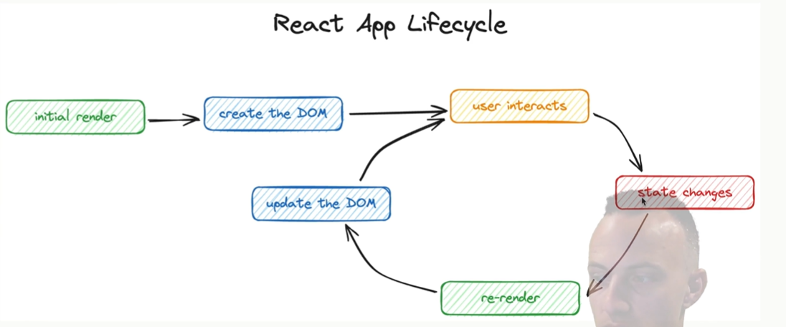

# React Lifecycle

The React lifecycle begins with the **initial render**, where the component is first rendered to the DOM. During this phase, React creates the **DOM elements** based on the component's structure and state.

When a **user interacts** with the application (e.g., clicking a button or typing in an input), the component's state may change. This triggers a **re-render**. Unlike a full page refresh, React efficiently updates only the parts of the UI that have changed. It achieves this by comparing the **old virtual DOM** with the **new virtual DOM** in a process called **reconciliation**. React then applies only the **necessary changes** to the real DOM, ensuring optimal performance.

After the update, React waits for the next **user interaction**, and the cycle repeats. 

